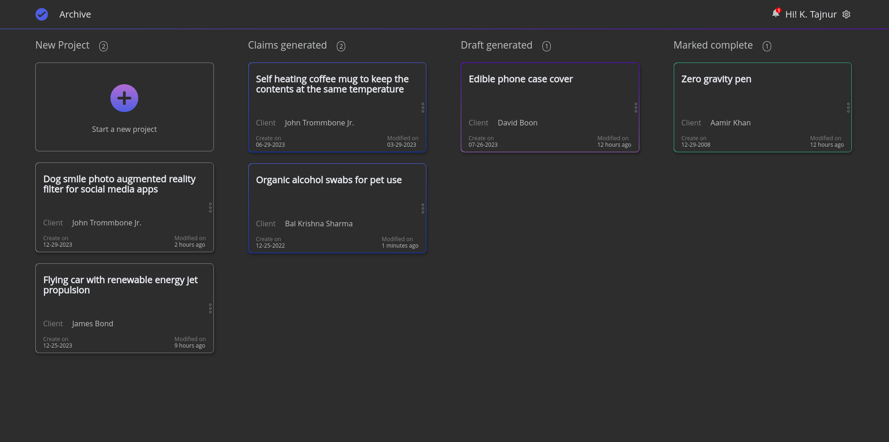

  <h1>Wrap Plan</h1>

  

## Project Requirements
Each card is represented is a UI component. It encompasses four distinct statuses: New Project, Claims Generated, Draft Generated, and Completed. The card retrieves project title, client information, creation date, and last modification date from the attached file (treat 'data.json' as a database and employ services to fetch it).

Additionally, there is another file ('time.json') that contains the time required to reach each status.For instance, if 'claims_generated' is set to 6, it would take 6 seconds for the card to appear under Claims Generated after you change the card's status to Claims Generated. The appearance will seamlessly occur during retrieval from the database. We are not seeking drag and drop functionality for change status. Find a creative way to change the status within the card. [Example: You may have a change status form after you right click on the card]

Your task is to craft the UI as depicted in the attached design, aiming for pixel-perfection. Notably, when the card's status changes, it should automatically transition to the new status. Only HTML, CSS, and vanilla JS are permitted for this task.
